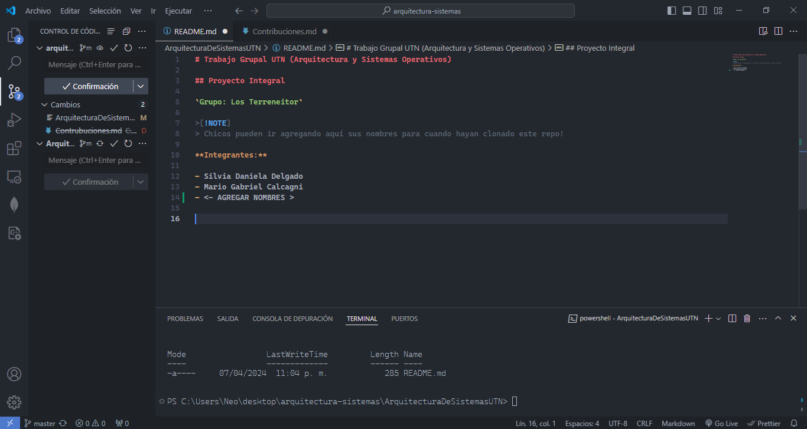

# Contribuciones

Este artículo explica cómo contribuir al repositrio del Trabajo Grupal de Arquitectura y Sistemas Operativos de la UTN.

**Grupo: LOS TERRENEITORS**

## Para empezar vamos a utilizar `git bash` para clonar este repositorio.

```bash
git clone https://github.com/silvia-daniela-delgado/ArquitecturaDeSistemasUTN.git
```

1. Una vez clonado el repo, podemos ver el nombre de la carpeta con el comando `ls`:

```bash
Neo@DESKTOP-5ULIFRA MINGW64 ~/desktop (master)
$ ls
 CPE-Config/      'UTN - TUP'/                  nextjs-dashboard/
 Cosas/           *ArquitecturaDeSistemasUTN/*   portfolioWeb/
```

2. Entramos en la carpeta:

```bash
cd arquitecturadesitemasutn
```

3. Ya ubicados en la carpeta inicializamos `git`:

```bash
git init
```

4. Configuramos nuestro usuario:

```bash
git config user.email "micorreo-electronico86@mail.com"
git config user.name "Mi Nombre"
```

5. Modificamos el `README.md` agregando el nombre del integrante.



6. Preparamos el archivo para subirlo a la rama

```bash
git add .
```

7. Creamos un commit con la descripción de la modificación:

```bash
git commit -m "mi primer commit (modificación readme.md)"
```

8. Empujamos los cambios al repositorio de la rama master:

```bash
git push -u origin master
```

Con estos pasos ya se debería actualizar el repositorio.


